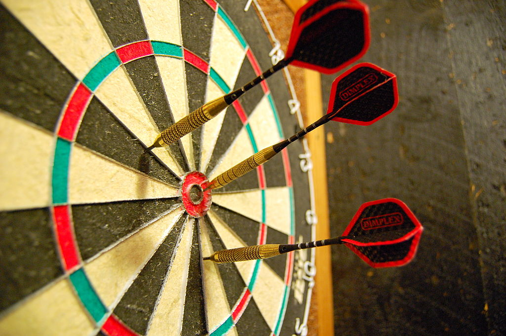
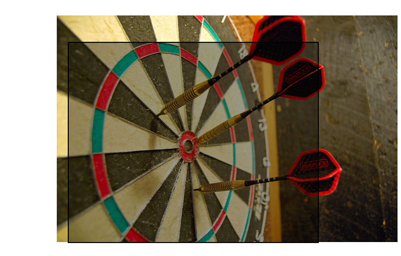

# Focus Point
If you put a picture as the background of a `<div>` with specified height and width, then often it will crop out a part of the image. How do we make sure that a particular point of the image is always inside this frame?

For example, which relative `top` and `left` do you need to make it so the bulls-eye of this dartboard

is exactly in the middle of some given `<div>`?

### The solution

Include `focuspoint.css` in your header and put the following code:
```HTML
<div id='example' style='
	position: relative;
	overflow: hidden;
	width: 500px;
	height: 400px;
'>
	
</div>
```
And here is how it will look (without `overflow: hidden;`):


### How to use
* Make sure the `--width` and `--height` variables are set to the width and height of the containing element.
* For the aspect ratio `--r`, you can directly input the width and height of your picture (using `calc`). 
* `--x` is a number between 0 and 1 representing how far the point of focus is from the left of the picture.
* `--y` is a number between 0 and 1 representing how far the point of focus is from the top of the picture.

### Mathematical explanation
If you want to learn how the code works, I've included an explanation in the folder.
